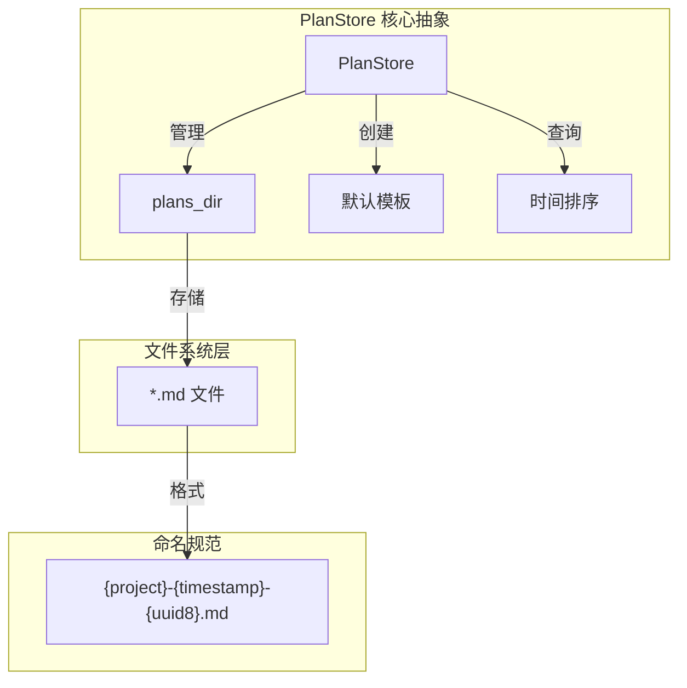
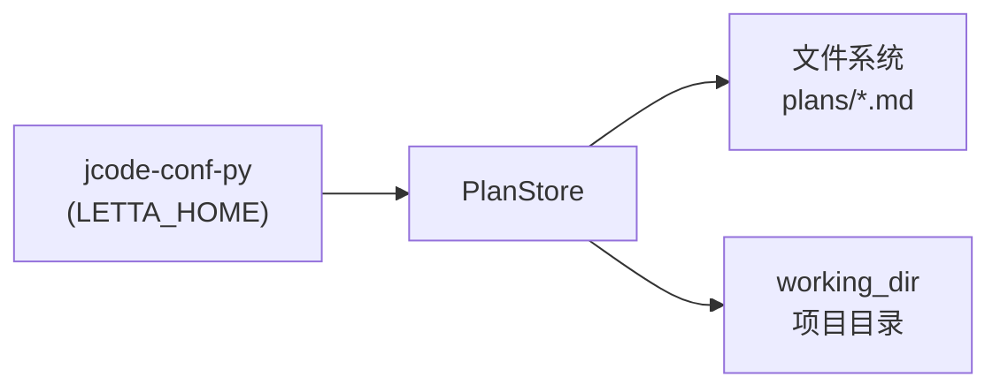

# 核心概念

## 概述

jcode-plans-py 是一个轻量级的实施计划（Implementation Plan）文档存储库，从 `jcode` 项目中提取。它通过文件系统（FS）后端存储 Markdown 格式的计划文档，提供简单可靠的持久化方案。

## 关键术语

| 术语 | 定义 | 示例 |
|------|------|------|
| **PlanStore** | 核心抽象类，负责管理计划文档的创建、查询和存储 | `PlanStore(working_dir)` |
| **计划文档** | Markdown 格式的实施计划文件 | `backend-api-20260326-143052-a1b2c3d4.md` |
| **plans_dir** | 存储所有计划文件的目录 | `{LETTA_HOME}/plans/` |
| **项目名** | 计划的标识前缀，用于组织和过滤 | `backend-api` |
| **working_dir** | 当前工作目录，通常是项目根目录 | `Path.cwd()` |
| **letta_home** | 配置路径前缀，默认来自 `jcode-conf-py` | `~/.letta/` |

## 概念模型



## 设计哲学

1. **简单可靠**：使用文件系统作为唯一存储，无数据库依赖
2. **不可变性**：`PlanStore` 使用 `frozen=True` 保证线程安全
3. **约定优于配置**：文件命名和目录结构遵循约定
4. **松耦合**：依赖外部 `jcode-conf-py` 获取配置路径

## 核心数据结构

```python
@dataclass(frozen=True)
class PlanStore:
    working_dir: Path      # 工作目录（项目根目录）
    letta_home: Path | None  # 计划存储根目录（可选）
```

## 关键行为

| 行为 | 说明 |
|------|------|
| `create_plan_file()` | 在 `plans_dir` 中创建新的 Markdown 计划文件 |
| `list_plans()` | 返回所有计划文件列表，支持按项目名过滤 |
| `ensure_initialized()` | 确保 `plans_dir` 目录存在 |

## 与外部系统的关系


