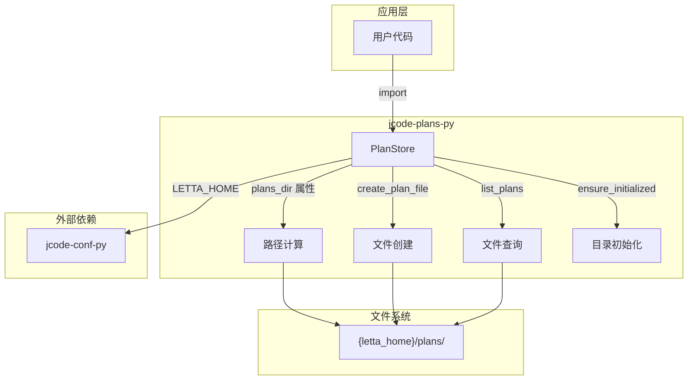
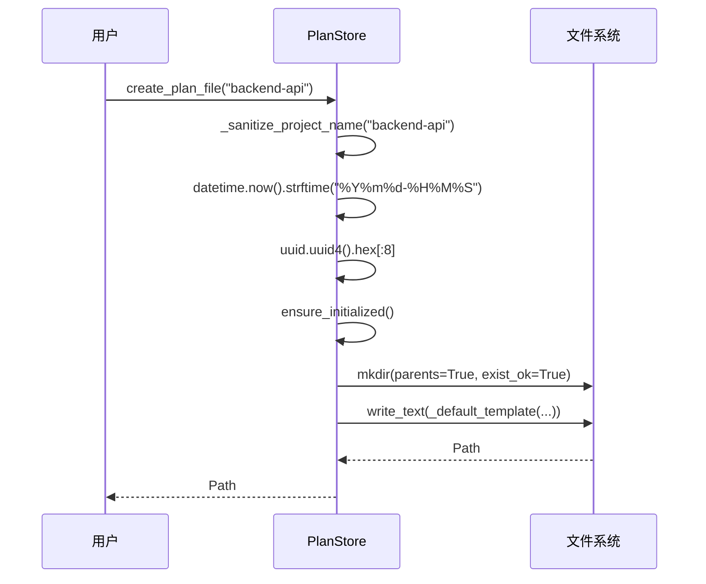
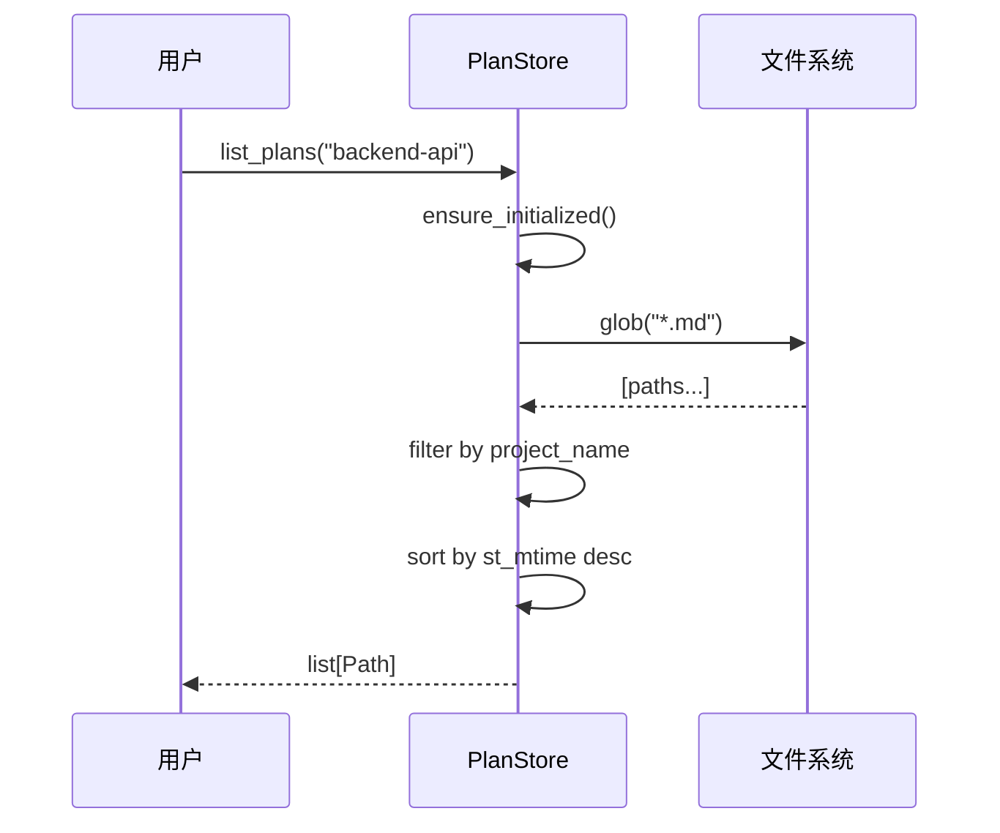

# 核心架构

## 概述

jcode-plans-py 采用极简架构，以 `PlanStore` 为单一入口点，通过文件系统实现计划文档的持久化存储。

## 系统概览



## 组件层级

```
┌─────────────────────────────────────┐
│         用户代码 (应用层)             │
├─────────────────────────────────────┤
│    PlanStore (核心 API 抽象)          │
│    ├── create_plan_file()          │
│    ├── list_plans()                │
│    └── ensure_initialized()        │
├─────────────────────────────────────┤
│    文件系统存储 (持久化层)             │
│    └── plans_dir/*.md              │
├─────────────────────────────────────┤
│    外部依赖                          │
│    └── jcode-conf-py (配置)         │
└─────────────────────────────────────┘
```

## 关键设计模式

### 1. 不可变数据类 (Immutable Dataclass)

```python
@dataclass(frozen=True)
class PlanStore:
    working_dir: Path
    letta_home: Path | None = None
```

**意图**：确保 `PlanStore` 实例线程安全，不可修改

**效果**：
- 初始化后属性不可变更
- 天然支持多线程并发访问
- `__post_init__` 中使用 `object.__setattr__` 处理路径规范化

### 2. 文件系统命名约定

```
{project}-{timestamp}-{uuid8}.md
```

| 组成部分 | 说明 | 示例 |
|----------|------|------|
| `project` | 项目名（消毒后） | `backend-api` |
| `timestamp` | 创建时间（精确到秒） | `20260326-143052` |
| `uuid8` | UUID 前8位（唯一标识） | `a1b2c3d4` |

**意图**：确保文件名唯一且可预测

### 3. 路径解析策略

```python
def _resolve_letta_home(letta_home: Path | None = None) -> Path:
    if letta_home is not None:
        return letta_home.expanduser().resolve()
    return LETTA_HOME
```

**意图**：统一处理相对路径、用户路径符号和符号链接

## 数据流

### 创建计划文件流程



### 查询计划文件流程



## 扩展点

本库设计为单一用途，扩展方式有限：

| 扩展方式 | 实现方法 |
|----------|----------|
| **自定义存储位置** | 传入 `letta_home` 参数 |
| **自定义模板** | 修改 `_default_template` 静态方法（需子类化） |
| **自定义命名** | 修改 `create_plan_file` 中的命名逻辑 |

## 限制

- **无事务支持**：文件操作非原子性
- **无索引**：查询依赖文件系统 glob，性能随文件数线性下降
- **无版本控制**：不管理计划的历史版本
- **无锁定机制**：多进程并发写入可能冲突
