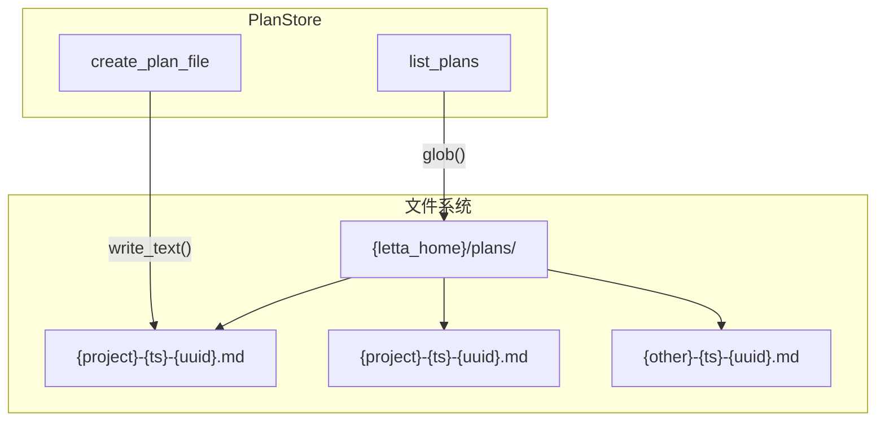
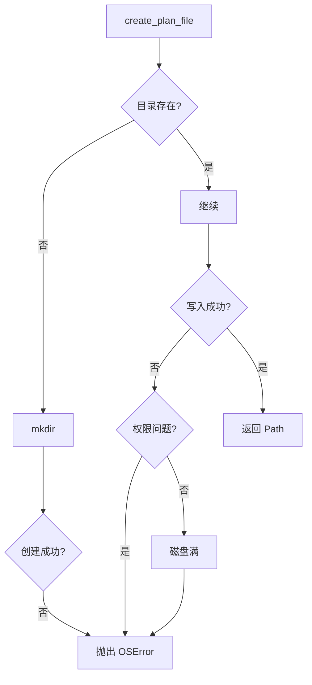

# 特性 2：Markdown 文件持久化

## 概述

jcode-plans-py 使用本地文件系统作为唯一持久化后端，计划文档以 Markdown 格式存储在 `plans_dir` 目录中。

## 概览

| 方面 | 说明 |
|------|------|
| **存储格式** | Markdown (`.md`) |
| **存储位置** | `{letta_home}/plans/` |
| **命名模式** | `{project}-{timestamp}-{uuid8}.md` |
| **内容结构** | 标题 + 项目名 + 8 个标准章节 |

## 设计意图

**解决的问题**：
- 简单可靠的持久化，无需数据库依赖
- 人类可读的文件格式，便于版本控制
- 与现有编辑器和工作流兼容

**设计决策**：
- 选择 Markdown 因其通用性和可读性
- 文件名包含时间戳和 UUID 确保唯一性
- 约定优于配置，减少用户配置负担

## 架构



## 契约（Contract）

| 方面 | 说明 |
|------|------|
| **输入** | `create_plan_file(content: str)` |
| **输出** | 写入成功返回 `Path`，内容为 UTF-8 编码 |
| **副作用** | 在 `plans_dir` 创建新文件 |
| **错误** | 权限不足抛出 `PermissionError`，磁盘满抛出 `OSError` |
| **幂等** | 否，每次调用创建新文件 |
| **版本** | v1.0.0 稳定 |

## 文件命名规范

```
{project}-{timestamp}-{uuid8}.md
  │       │           │
  │       │           └─ 8 位 UUID（唯一标识）
  │       └─ 创建时间（精确到秒）
  └─ 项目名（消毒后）
```

### 示例文件名

```
backend-api-20260326-143052-a1b2c3d4.md
frontend-ui-20260326-120000-f5e6d7c8.md
```

## 集成矩阵

| 依赖 | 接口语义 | 失败策略 |
|------|----------|----------|
| 文件系统 | `Path.write_text/read_text` | 抛出 `OSError` |
| `pathlib` | 路径对象 | N/A |

## 使用示例

### Algorithm：创建计划文件

```
BEGIN
  # 1. 确定存储路径
  plans_dir = letta_home / "plans"

  # 2. 确保目录存在
  plans_dir.mkdir(parents=True, exist_ok=True)

  # 3. 生成文件名
  project = "backend-api"
  timestamp = datetime.now().strftime("%Y%m%d-%H%M%S")
  uuid_part = uuid.uuid4().hex[:8]
  filename = f"{project}-{timestamp}-{uuid_part}.md"

  # 4. 构造内容
  content = _default_template(project)

  # 5. 写入文件
  file_path = plans_dir / filename
  file_path.write_text(content, encoding="utf-8")

  RETURN file_path
END
```

### 手动操作示例

```bash
# 查看存储目录
ls -la ~/.letta/plans/

# 查看计划内容
cat ~/.letta/plans/backend-api-20260326-143052-a1b2c3d4.md

# 使用任意编辑器修改
vim ~/.letta/plans/backend-api-20260326-143052-a1b2c3d4.md
```

## 失败与降级



| 失败场景 | 行为 |
|----------|------|
| 目录不存在 | 自动创建（`mkdir(parents=True)`） |
| 权限不足 | 抛出 `PermissionError` |
| 磁盘满 | 抛出 `OSError` |
| 文件已存在 | 不会发生（UUID 保证唯一） |

## 高级主题

### 版本控制集成

由于使用纯文本文件，可以直接纳入 Git：

```bash
cd ~/.letta/plans
git init
git add .
git commit -m "Add implementation plans"
```

### 备份策略

```bash
# 简单备份
cp -r ~/.letta/plans ~/backup/plans-$(date +%Y%m%d)

# 使用 rsync
rsync -av ~/.letta/plans/ ~/backup/plans/
```

## 限制与权衡

| 限制 | 说明 |
|------|------|
| **无原子性** | 文件写入非原子操作 |
| **无锁定** | 多进程并发写入可能冲突 |
| **无增量** | 每次保存完整文件，无版本差异 |

## 相关特性

- [04-feature-planstore-abstraction](04-feature-planstore-abstraction.md) - 上层抽象
- [06-feature-file-naming-convention](06-feature-file-naming-convention.md) - 命名规范
