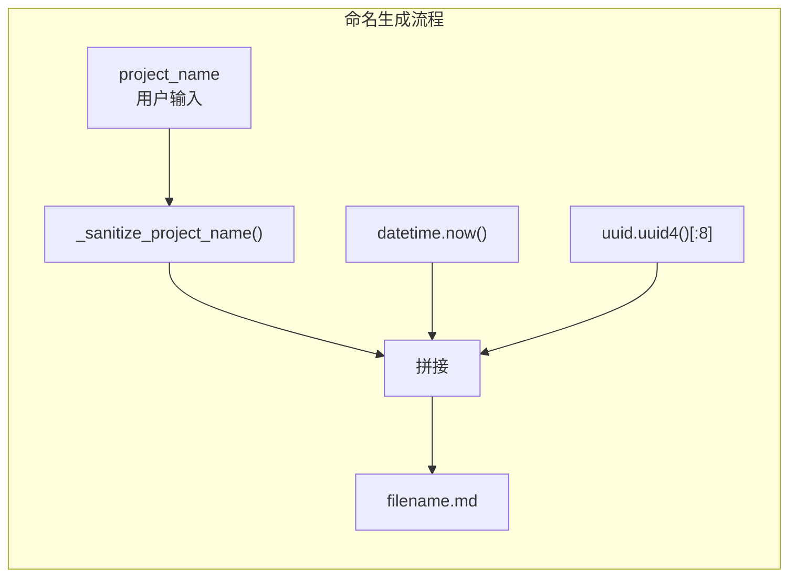

# 特性 3：计划文件命名规范

## 概述

jcode-plans-py 使用严格的文件命名约定 `{project}-{timestamp}-{uuid8}.md`，确保计划文件唯一、可预测且文件系统友好。

## 概览

| 组件 | 格式 | 示例 |
|------|------|------|
| 项目名 | 消毒后的字符串 | `backend-api` |
| 时间戳 | `%Y%m%d-%H%M%S` | `20260326-143052` |
| UUID | 8 位十六进制 | `a1b2c3d4` |
| 完整格式 | `{project}-{ts}-{uuid}.md` | `backend-api-20260326-143052-a1b2c3d4.md` |

## 设计意图

**解决的问题**：
- 文件名冲突（同项目同秒创建）
- 文件系统特殊字符问题
- 人类可读性与唯一性平衡

**设计决策**：
- 时间戳精确到秒，提供基本时间信息
- UUID 前8位提供足够熵值避免冲突
- 项目名消毒确保文件名合法

## 架构



## 契约（Contract）

| 方面 | 说明 |
|------|------|
| **输入** | `project_name: str`（用户可见的项目名） |
| **输出** | 符合文件命名规范的字符串 |
| **副作用** | 无 |
| **错误** | 无（空输入有默认值） |
| **幂等** | 相同输入产生相同输出 |
| **版本** | v1.0.0 稳定 |

## 项目名消毒规则

```python
def _sanitize_project_name(name: str) -> str:
    name = name.strip()                              # 去除首尾空白
    name = re.sub(r"[^A-Za-z0-9._-]+", "-", name)   # 非允许字符转-
    return name.strip("-") or "project"              # 去除首尾-，空则默认
```

### 消毒示例

| 输入 | 输出 |
|------|------|
| `"backend-api"` | `backend-api` |
| `"My Project!"` | `My-Project-` |
| `"  spaces  "` | `spaces` |
| `"!!!invalid"` | `invalid` |
| `""` | `project`（默认值） |
| `"/etc/passwd"` | `etc-passwd` |

## 时间戳格式

```python
datetime.now().strftime("%Y%m%d-%H%M%S")
```

| 占位符 | 含义 | 示例 |
|--------|------|------|
| `%Y` | 4位年 | `2026` |
| `%m` | 2位月 | `03` |
| `%d` | 2位日 | `26` |
| `%H` | 2位时（24h） | `14` |
| `%M` | 2位分 | `30` |
| `%S` | 2位秒 | `52` |

**注意**：时间戳与 UUID 结合使用，即使同一秒创建也不会冲突。

## 集成矩阵

| 依赖 | 接口语义 | 失败策略 |
|------|----------|----------|
| `datetime.now()` | 获取当前时间 | 极少失败 |
| `uuid.uuid4()` | 生成 UUID | 极少失败 |
| `re.sub()` | 正则替换 | 总是成功 |

## 使用示例

### Algorithm：生成唯一文件名

```
BEGIN FUNCTION generate_filename(project_name: str) -> str
  # 1. 消毒项目名
  safe_name = _sanitize_project_name(project_name)

  # 2. 生成时间戳
  timestamp = datetime.now().strftime("%Y%m%d-%H%M%S")

  # 3. 生成 UUID 前8位
  unique_id = uuid.uuid4().hex[:8]

  # 4. 拼接
  filename = f"{safe_name}-{timestamp}-{unique_id}.md"

  RETURN filename
END FUNCTION
```

### Python 示例

```python
from jcode_plans.store import _sanitize_project_name
from datetime import datetime
import uuid

# 消毒
name = _sanitize_project_name("Backend API v2!")
# -> "Backend-API-v2-"

# 生成文件名
ts = datetime.now().strftime("%Y%m%d-%H%M%S")
uid = uuid.uuid4().hex[:8]
filename = f"{name}-{ts}-{uid}.md"
# -> "Backend-API-v2---20260326-143052-a1b2c3d4.md"
```

## 边界情况

| 输入 | 行为 | 结果示例 |
|------|------|----------|
| `None` | 使用 `working_dir.name` | `myproject-20260326-143052-a1b2c3d4.md` |
| 纯空格 | 返回默认值 | `project-20260326-143052-a1b2c3d4.md` |
| 全特殊字符 | 逐步消毒后默认值 | `project-20260326-143052-a1b2c3d4.md` |
| 超长名称 | 保留（文件系统限制） | `very-long-project-name-...` |
| Unicode | 保留字母数字 | `项目-20260326-143052-a1b2c3d4.md` |

## 高级主题

### 手动重建文件名信息

```python
from pathlib import Path
import re

def parse_plan_filename(path: Path) -> dict:
    """从文件名解析各组件"""
    stem = path.stem  # 去除 .md
    parts = stem.split("-")

    # 尝试解析时间戳（14位数字）
    # 格式: {project}-{YYYYmmdd-HHMMSS}-{uuid8}
    timestamp_pattern = r"(\d{8}-\d{6})"
    match = re.search(timestamp_pattern, stem)

    if match:
        ts_str = match.group(1)
        project = stem[:match.start()].rstrip("-")
        return {
            "project": project,
            "timestamp": ts_str,
            "uuid": stem[match.end():].lstrip("-")
        }
    return {"project": stem, "timestamp": None, "uuid": None}
```

## 限制与权衡

| 限制 | 说明 |
|------|------|
| **时间戳无时区** | 使用本地时间，可能因夏令时跳变 |
| **UUID 无序** | 无法从 UUID 推断创建顺序 |
| **项目名信息丢失** | 过长项目名被截断为前缀 |

## 相关特性

- [05-feature-filesystem-persistence](05-feature-filesystem-persistence.md) - 文件存储
- [11-feature-project-filtering](11-feature-project-filtering.md) - 项目过滤
