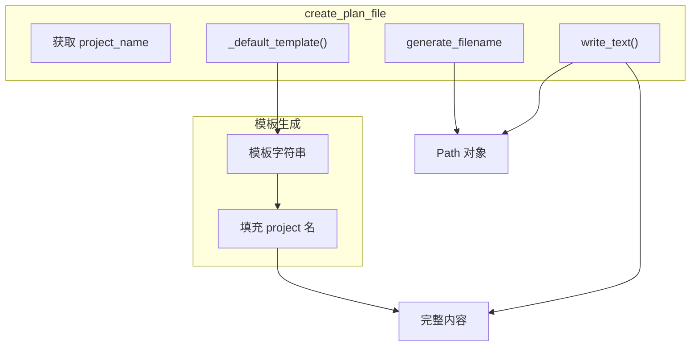

# 特性 4：默认计划模板

## 概述

jcode-plans-py 为所有新创建的计划文档提供标准化的 Markdown 模板，确保团队遵循统一的计划格式。

## 概览

模板结构包含8个标准章节，覆盖从概述到验证的完整计划生命周期。

## 设计意图

**解决的问题**：
- 团队成员计划格式不统一
- 新用户不知从何开始
- 缺少关键计划内容（如 Verification）

**设计决策**：
- 固定模板避免选择困难
- 章节顺序符合 PDCA（Plan-Do-Check-Act）思维
- 预留灵活性（Notes 部分）

## 模板结构

```markdown
# Implementation Plan

**Project**: {project}

## Overview

## Requirements

## Analysis

## Proposed Changes

## Implementation Steps

## Verification

## Notes
```

### 章节说明

| 章节 | 用途 | 预期内容 |
|------|------|----------|
| `Overview` | 简要说明计划目标 | 一段话描述要做什么 |
| `Requirements` | 需求/前置条件 | 功能需求、性能要求、约束 |
| `Analysis` | 问题分析 | 现状分析、问题根因、方案评估 |
| `Proposed Changes` | 变更方案 | 详细设计、架构图、API 变更 |
| `Implementation Steps` | 实施步骤 | 编号步骤、依赖关系 |
| `Verification` | 验证方法 | 测试计划、验收标准 |
| `Notes` | 备注 | 风险、注意事项、后续工作 |

## 架构



## 契约（Contract）

| 方面 | 说明 |
|------|------|
| **输入** | `project: str`（项目名） |
| **输出** | 完整 Markdown 字符串（UTF-8） |
| **副作用** | 无 |
| **错误** | 无 |
| **幂等** | 相同输入产生相同输出 |
| **版本** | v1.0.0 稳定 |

## API 参考

### _default_template

```python
@staticmethod
def _default_template(project: str) -> str:
    return (
        "# Implementation Plan\n\n"
        f"**Project**: {project}\n\n"
        "## Overview\n\n"
        "## Requirements\n\n"
        "## Analysis\n\n"
        "## Proposed Changes\n\n"
        "## Implementation Steps\n\n"
        "## Verification\n\n"
        "## Notes\n"
    )
```

**注意**：这是静态方法，可被子类覆盖以自定义模板。

## 集成矩阵

| 依赖 | 接口语义 | 失败策略 |
|------|----------|----------|
| `str.format()` | 字符串插值 | 永不失败 |

## 使用示例

### Algorithm：创建带模板的计划

```
BEGIN FUNCTION create_plan_file(project_name)
  # 1. 确定项目名
  IF project_name IS NULL
    project = working_dir.name
  ELSE
    project = _sanitize_project_name(project_name)
  END IF

  # 2. 生成文件名
  filename = generate_filename(project)

  # 3. 生成内容
  content = _default_template(project)

  # 4. 写入
  path = plans_dir / filename
  path.write_text(content, encoding="utf-8")

  RETURN path
END FUNCTION
```

### Python 示例

```python
store = PlanStore(Path.cwd())
plan_path = store.create_plan_file("backend-api")

content = plan_path.read_text()
print(content)
# # Implementation Plan
# **Project**: backend-api
#
# ## Overview
#
# ## Requirements
#
# ...
```

### 自定义模板

```python
class CustomPlanStore(PlanStore):
    @staticmethod
    def _default_template(project: str) -> str:
        return (
            f"# {project} 实施计划\n\n"
            "## 背景\n\n"
            "## 目标\n\n"
            "## 方案\n\n"
            "## 里程碑\n\n"
        )
```

## 高级主题

### 国际化模板

```python
class I18nPlanStore(PlanStore):
    def __init__(self, working_dir, letta_home=None, lang="en"):
        super().__init__(working_dir, letta_home)
        self.lang = lang

    def _default_template(self, project: str) -> str:
        templates = {
            "en": "# Implementation Plan\n\n**Project**: {project}\n\n...",
            "zh": "# 实施计划\n\n**项目**: {project}\n\n...",
        }
        template = templates.get(self.lang, templates["en"])
        return template.format(project=project)
```

## 限制与权衡

| 限制 | 说明 |
|------|------|
| **硬编码结构** | 模板结构不可外部配置 |
| **无变量替换** | 仅支持 `{project}` 插值 |
| **无条件章节** | 所有章节都包含，无条件包含/排除 |

## 相关特性

- [04-feature-planstore-abstraction](04-feature-planstore-abstraction.md) - 创建入口
- [05-feature-filesystem-persistence](05-feature-filesystem-persistence.md) - 文件存储
