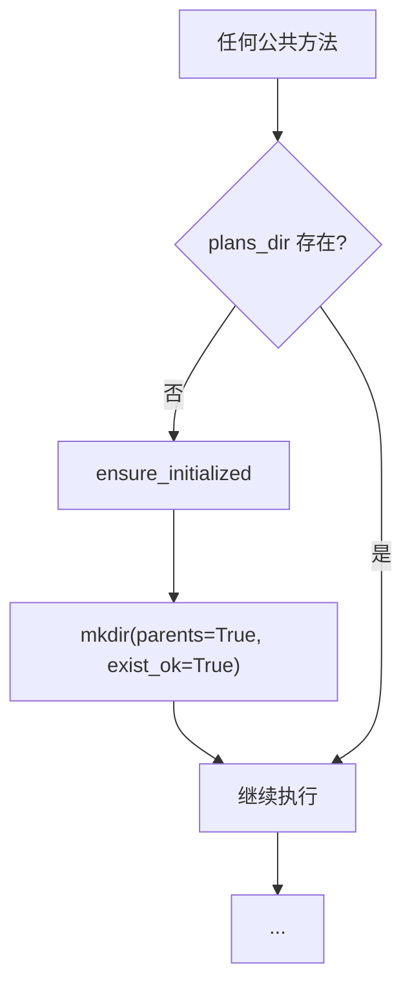
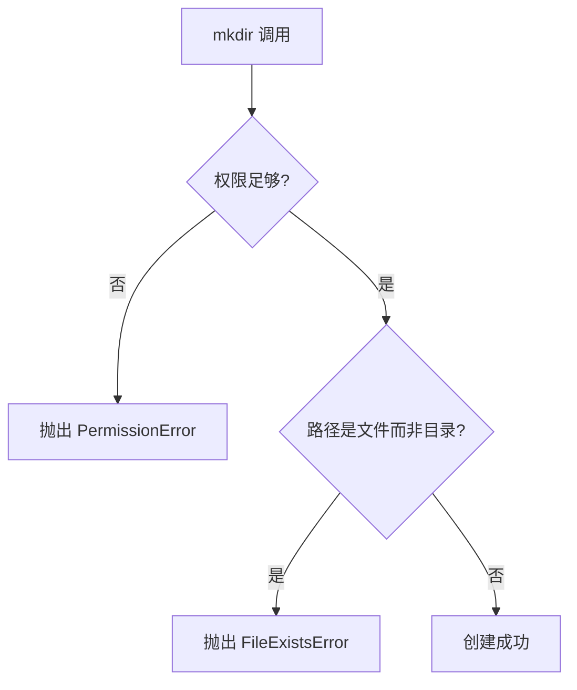

# 特性 5：目录初始化管理

## 概述

jcode-plans-py 自动管理存储目录的创建，确保 `plans_dir` 在首次使用前已正确初始化。

## 概览

| 方面 | 说明 |
|------|------|
| **目标目录** | `{letta_home}/plans/` |
| **创建策略** | 按需创建（懒初始化） |
| **调用时机** | `create_plan_file()` 和 `list_plans()` 首次调用时 |

## 设计意图

**解决的问题**：
- 用户无需手动创建目录
- 减少初始化样板代码
- 避免文件操作时目录不存在的错误

**设计决策**：
- 懒初始化：仅在首次使用时创建
- `mkdir(parents=True, exist_ok=True)` 简化逻辑
- 所有公共方法内部调用 `ensure_initialized()`

## 架构



## 契约（Contract）

| 方面 | 说明 |
|------|------|
| **输入** | 无 |
| **输出** | 无（`None`） |
| **副作用** | 可能创建目录及中间父目录 |
| **错误** | 权限不足抛出 `PermissionError` |
| **幂等** | 是（已存在时无操作） |
| **版本** | v1.0.0 稳定 |

## API 参考

### ensure_initialized

```python
def ensure_initialized(self) -> None:
    self.plans_dir.mkdir(parents=True, exist_ok=True)
```

### plans_dir 计算属性

```python
@property
def plans_dir(self) -> Path:
    return Path(self.letta_home) / "plans"
```

## 集成矩阵

| 依赖 | 接口语义 | 失败策略 |
|------|----------|----------|
| `pathlib.Path.mkdir()` | 创建目录 | 抛出 `OSError` |

## 使用示例

### Algorithm：懒初始化流程

```
BEGIN
  # 用户代码
  store = PlanStore(Path.cwd())

  # 首次调用 create_plan_file
  # 内部自动调用 ensure_initialized
  plan = store.create_plan_file("test")

  # 等价于手动:
  plans_dir = Path.home() / ".letta" / "plans"
  plans_dir.mkdir(parents=True, exist_ok=True)

  # 后续调用不再创建目录
  plans = store.list_plans()
  # ensure_initialized 再次调用但无副作用
END
```

### Python 示例

```python
from pathlib import Path
from jcode_plans import PlanStore

store = PlanStore(Path.cwd())

# 内部自动初始化
plan = store.create_plan_file("my-project")

# 验证目录存在
print(store.plans_dir.exists())  # True
print(store.plans_dir.is_dir())  # True
```

### 手动预初始化

```python
# 预初始化（可选）
store = PlanStore(Path.cwd())
store.ensure_initialized()

# 之后可以安全地直接操作目录
import os
os.listdir(store.plans_dir)
```

## 失败与降级



| 失败场景 | 行为 |
|----------|------|
| 权限不足 | 抛出 `PermissionError` |
| 父目录是文件 | 抛出 `FileExistsError` |
| 磁盘满 | 抛出 `OSError` |

## 高级主题

### 自定义初始化逻辑

```python
class CustomPlanStore(PlanStore):
    def ensure_initialized(self) -> None:
        # 自定义初始化逻辑
        if not self.plans_dir.exists():
            self.plans_dir.mkdir(parents=True, exist_ok=True)
            # 创建 .gitkeep
            (self.plans_dir / ".gitkeep").touch()
        # 调用父类
        super().ensure_initialized()
```

### 多层目录结构

```python
class HierarchicalPlanStore(PlanStore):
    @property
    def plans_dir(self) -> Path:
        # 按年/月组织
        now = datetime.now()
        return Path(self.letta_home) / "plans" / str(now.year) / str(now.month)

    def ensure_initialized(self) -> None:
        # 确保嵌套目录存在
        self.plans_dir.mkdir(parents=True, exist_ok=True)
```

## 限制与权衡

| 限制 | 说明 |
|------|------|
| **无初始化回调** | 无法在创建前后注入逻辑 |
| **无初始化状态查询** | 无法知道是否已初始化 |
| **非原子** | 检查和创建非原子操作 |

## 相关特性

- [04-feature-planstore-abstraction](04-feature-planstore-abstraction.md) - 核心抽象
- [05-feature-filesystem-persistence](05-feature-filesystem-persistence.md) - 存储机制
