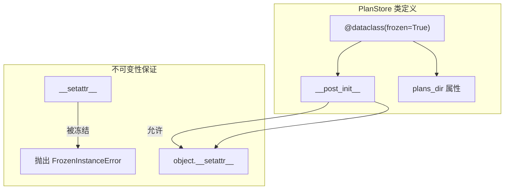
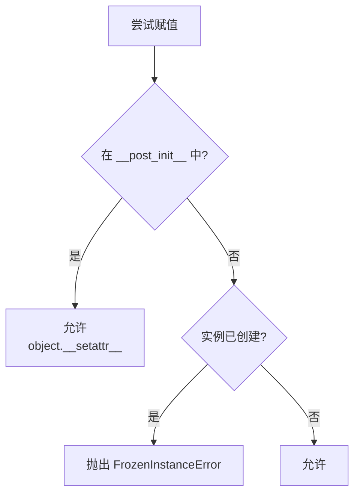

# 特性 6：不可变数据类设计

## 概述

jcode-plans-py 使用 Python 的 `@dataclass(frozen=True)` 实现 `PlanStore`，确保实例创建后状态不可变，天然支持多线程并发访问。

## 概览

| 特性 | 说明 |
|------|------|
| **实现方式** | `@dataclass(frozen=True)` |
| **线程安全** | 天然安全，无锁需求 |
| **状态修改** | 仅通过 `object.__setattr__` 在 `__post_init__` 中修改 |

## 设计意图

**解决的问题**：
- 意外修改 `PlanStore` 实例状态导致的不一致
- 多线程并发访问时的竞态条件
- 简化推理（实例一旦创建，属性不变）

**设计决策**：
- 选择 frozen dataclass 而非自定义 `__setattr__`
- `__post_init__` 中规范化路径（唯一例外）
- 对外呈现不可变，内部仍可有限修改

## 架构



## 契约（Contract）

| 方面 | 说明 |
|------|------|
| **输入** | `working_dir: Path`, `letta_home: Path \| None` |
| **输出** | 不可变实例 |
| **副作用** | `__post_init__` 中规范化路径 |
| **错误** | 创建后赋值抛出 `FrozenInstanceError` |
| **幂等** | N/A |
| **版本** | v1.0.0 稳定 |

## 实现细节

```python
@dataclass(frozen=True)
class PlanStore:
    working_dir: Path
    letta_home: Path | None = None

    def __post_init__(self) -> None:
        # frozen=True 时普通赋值被禁止
        # 使用 object.__setattr__ 绕过冻结
        object.__setattr__(self, "working_dir", self.working_dir.expanduser().resolve())
        object.__setattr__(self, "letta_home", _resolve_letta_home(self.letta_home))
```

**为什么需要 `object.__setattr__`**：
- `frozen=True` 使所有 `__setattr__` 调用抛出 `FrozenInstanceError`
- `__post_init__` 需要规范化传入的路径
- `object.__setattr__` 是唯一合法的内部修改途径

## 集成矩阵

| 依赖 | 接口语义 | 失败策略 |
|------|----------|----------|
| `dataclasses.dataclass` | 语法糖 | N/A |
| `pathlib.Path` | 路径操作 | N/A |

## 使用示例

### Algorithm：不可变性保证

```
BEGIN
  # 1. 创建实例
  store = PlanStore(Path.cwd())

  # 2. 尝试修改属性
  ATTEMPT store.letta_home = Path("/tmp")
  # -> 抛出 FrozenInstanceError

  # 3. 正确的修改方式是创建新实例
  store2 = PlanStore(Path("/tmp"))
  # -> 成功

  # 4. 多线程访问
  PARALLEL
    T1: store.list_plans()
    T2: store.create_plan_file()
    T3: store.list_plans()
  # -> 所有线程安全执行
END
```

### Python 示例

```python
from jcode_plans import PlanStore
from pathlib import Path
from dataclasses import FrozenInstanceError

store = PlanStore(Path.cwd())

# 尝试修改会失败
try:
    store.letta_home = Path("/tmp")
except FrozenInstanceError as e:
    print(f"Cannot modify: {e}")

# 正确做法：创建新实例
new_store = PlanStore(Path.cwd(), letta_home=Path("/tmp"))
```

### 线程安全示例

```python
from concurrent.futures import ThreadPoolExecutor
from jcode_plans import PlanStore
from pathlib import Path

store = PlanStore(Path.cwd())

def worker(n):
    plans = store.list_plans()
    return len(plans)

with ThreadPoolExecutor(max_workers=10) as executor:
    futures = [executor.submit(worker, i) for i in range(100)]
    results = [f.result() for f in futures]

print(f"All {len(results)} threads completed safely")
```

## 失败与降级



| 场景 | 行为 |
|------|------|
| `store.attr = value` | 抛出 `FrozenInstanceError` |
| `store.__post_init__` 内 | 正常执行 |
| 多线程同时读取 | 安全 |
| 多线程同时写入 | 安全（无写入） |

## 高级主题

### 与其他不可变模式的对比

| 模式 | 优点 | 缺点 |
|------|------|------|
| `frozen=True` | 简洁、语法级别 | 需 `object.__setattr__` 处理规范化 |
| `__slots__` | 减少内存 | 不自动提供不可变性 |
| 自定义 `__setattr__` | 完全控制 | 更多代码 |
| `NamedTuple` | 可组合 | 灵活性较低 |

### 模拟可变行为（测试场景）

```python
# 测试中可能需要模拟修改
import unittest.mock

store = PlanStore(Path.cwd())

with unittest.mock.patch.object(PlanStore, 'plans_dir', new_callable=lambda: Path("/tmp/test")):
    # 这里 plans_dir 被"修改"
    pass
```

## 限制与权衡

| 限制 | 说明 |
|------|------|
| **调试困难** | 不可变对象在调试器中不便于观察中间状态 |
| **内存略高** | frozen dataclass 有轻微开销 |
| **嵌套不可变** | 内部 `Path` 对象仍可变（但不影响逻辑） |

## 相关特性

- [04-feature-planstore-abstraction](04-feature-planstore-abstraction.md) - 核心抽象
- [12-feature-path-resolution](12-feature-path-resolution.md) - 路径解析
