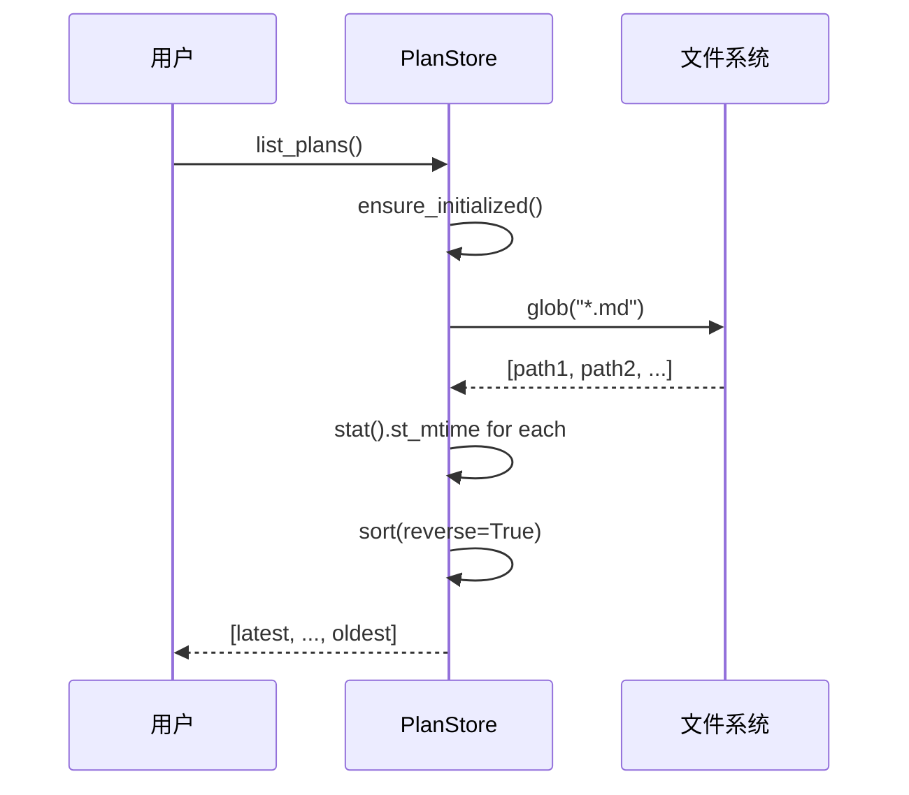

# 特性 7：时间排序查询

## 概述

`list_plans()` 返回的计划文件按修改时间（`st_mtime`）倒序排列，确保最新计划优先出现在列表前端。

## 概览

| 方面 | 说明 |
|------|------|
| **排序依据** | 文件系统 `st_mtime` |
| **排序方向** | 倒序（最新优先） |
| **实现方式** | `paths.sort(key=lambda p: p.stat().st_mtime, reverse=True)` |

## 设计意图

**解决的问题**：
- 用户通常关注最新计划
- 避免手动排序
- 模拟"最近使用"语义

**设计决策**：
- 使用 `st_mtime` 而非文件名时间戳（文件名时间可能与实际不符）
- 倒序符合直觉（最新在前）
- 依赖文件系统时间戳，可能受外部修改影响

## 架构



## 契约（Contract）

| 方面 | 说明 |
|------|------|
| **输入** | `project_name: str \| None` |
| **输出** | 按 `st_mtime` 倒序的 `list[Path]` |
| **副作用** | 无 |
| **错误** | 文件被删除时 `stat()` 抛出 `FileNotFoundError` |
| **幂等** | 是 |
| **版本** | v1.0.0 稳定 |

## 实现代码

```python
def list_plans(self, project_name: str | None = None) -> list[Path]:
    self.ensure_initialized()
    paths = list(self.plans_dir.glob("*.md"))

    if project_name:
        needle = _sanitize_project_name(project_name)
        paths = [p for p in paths if needle in p.name]

    paths.sort(key=lambda p: p.stat().st_mtime, reverse=True)
    return paths
```

## 集成矩阵

| 依赖 | 接口语义 | 失败策略 |
|------|----------|----------|
| `pathlib.Path.glob()` | 列举文件 | 目录不存在返回 `[]` |
| `pathlib.Path.stat()` | 获取文件元数据 | 文件不存在抛出异常 |

## 使用示例

### Algorithm：排序查询流程

```
BEGIN FUNCTION list_plans(project_name?)
  # 1. 确保目录存在
  ensure_initialized()

  # 2. 获取所有 .md 文件
  paths = glob("*.md")

  # 3. 可选：按项目名过滤
  IF project_name IS NOT NULL
    needle = _sanitize_project_name(project_name)
    paths = FILTER paths WHERE needle IN path.name
  END IF

  # 4. 获取修改时间
  FOR each path IN paths
    mtime = path.stat().st_mtime
  END FOR

  # 5. 倒序排序
  paths.sort(key=mtime, reverse=True)

  RETURN paths
END FUNCTION
```

### Python 示例

```python
store = PlanStore(Path.cwd())

# 创建多个计划
store.create_plan_file("project-a")
import time; time.sleep(1)
store.create_plan_file("project-b")
import time; time.sleep(1)
store.create_plan_file("project-c")

# 查询（最新在前）
plans = store.list_plans()
for i, plan in enumerate(plans):
    print(f"{i+1}. {plan.name}")
# 1. project-c-20260326-143100-xxx.md
# 2. project-b-20260326-143101-xxx.md
# 3. project-a-20260326-143102-xxx.md
```

### 获取最新计划

```python
store = PlanStore(Path.cwd())
plans = store.list_plans()

if plans:
    latest_plan = plans[0]
    print(f"Latest: {latest_plan.name}")
    print(f"Modified: {latest_plan.stat().st_mtime}")
```

## 失败与降级

```mermaid
flowchart TD
    A[list_plans] --> B["glob('*.md')"]
    B --> C{找到文件?}
    C -->|否| D[返回空列表]
    C -->|是| E{stat() 成功?}
    E -->|否| F{文件被删除?}
    F -->|是| G[跳过该文件]
    F -->|否| H[抛出异常]
    E -->|是| I[添加到列表]
    G --> I
    I --> J[sort by st_mtime]
    J --> K[返回列表]
```

| 失败场景 | 行为 |
|----------|------|
| 目录不存在 | 返回空列表 |
| 文件在 glob 后删除 | 跳过该文件 |
| 文件在 glob 前删除 | glob 不返回 |

## 高级主题

### 按创建时间排序（基于文件名）

```python
from datetime import datetime

def list_by_filename_time(store: PlanStore, project_name: str | None = None) -> list[Path]:
    """按文件名中的时间戳排序（而非文件系统时间）"""
    plans = store.list_plans(project_name)

    def parse_timestamp(p: Path) -> datetime:
        # 从文件名提取 {project}-{YYYYmmdd-HHMMSS}-{uuid}.md
        import re
        match = re.search(r"(\d{8}-\d{6})", p.name)
        if match:
            return datetime.strptime(match.group(1), "%Y%m%d-%H%M%S")
        return datetime.min

    return sorted(plans, key=parse_timestamp, reverse=True)
```

### 按文件大小排序

```python
def list_by_size(store: PlanStore) -> list[Path]:
    plans = store.list_plans()
    return sorted(plans, key=lambda p: p.stat().st_size, reverse=True)
```

## 限制与权衡

| 限制 | 说明 |
|------|------|
| **依赖文件系统时间** | `st_mtime` 可能被外部程序修改 |
| **无分页** | 大量文件时返回完整列表 |
| **stat 调用** | 每个文件一次 syscall，大目录慢 |

## 相关特性

- [11-feature-project-filtering](11-feature-project-filtering.md) - 项目过滤
- [06-feature-file-naming-convention](06-feature-file-naming-convention.md) - 命名规范
