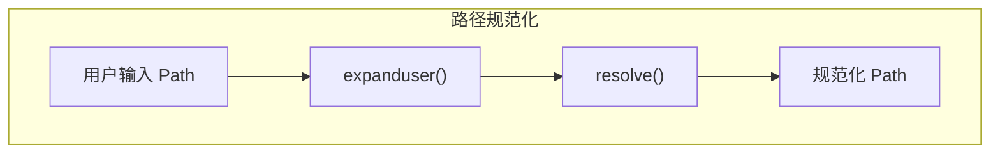
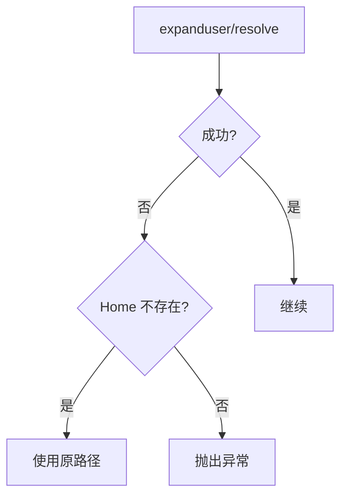

# 特性 9：路径解析处理

## 概述

jcode-plans-py 在初始化时统一规范化路径，处理用户路径符号（`~`）和相对路径，确保一致的存储位置。

## 概览

| 方面 | 说明 |
|------|------|
| **相对路径** | 转换为绝对路径 |
| **用户路径** | `~` 展开为 home 目录 |
| **符号链接** | 解析为真实路径 |
| **实现位置** | `__post_init__` |

## 设计意图

**解决的问题**：
- 用户传入相对路径或 `~` 导致存储位置不确定
- 符号链接导致同一目录多重表示
- `Path` 对象与字符串混用问题

**设计决策**：
- `expanduser()` 处理 `~`
- `resolve()` 处理符号链接和绝对化
- 在 `__post_init__` 中一次性规范化

## 路径解析函数

```python
def _resolve_letta_home(letta_home: Path | None = None) -> Path:
    if letta_home is not None:
        return letta_home.expanduser().resolve()
    return LETTA_HOME
```

### `expanduser()` 作用

| 输入 | 输出 |
|------|------|
| `Path("~/plans")` | `Path("/home/user/plans")` |
| `Path("/absolute/path")` | `Path("/absolute/path")` |
| `Path("relative/path")` | `Path("relative/path")`（未解析） |

### `resolve()` 作用

| 输入 | 输出 |
|------|------|
| `Path("./plans")` | `Path("/cwd/plans")` |
| `Path("../plans")` | `Path("/parent/plans")` |
| `symlink -> real` | `Path("/real/path")` |

## 架构



## 契约（Contract）

| 方面 | 说明 |
|------|------|
| **输入** | `Path \| None` |
| **输出** | 规范化后的 `Path` |
| **副作用** | 无 |
| **错误** | home 目录不存在时 `expanduser()` 可能失败 |
| **幂等** | 是 |
| **版本** | v1.0.0 稳定 |

## 集成矩阵

| 依赖 | 接口语义 | 失败策略 |
|------|----------|----------|
| `pathlib.Path.expanduser()` | 展开 `~` | 失败时返回原路径 |
| `pathlib.Path.resolve()` | 解析符号链接 | 失败时抛出 `OSError` |
| `jcode_conf.LETTA_HOME` | 默认路径 | 未安装时导入失败 |

## 使用示例

### Algorithm：路径规范化流程

```
BEGIN
  # PlanStore.__init__
  user_working_dir = working_dir_param
  user_letta_home = letta_home_param

  # __post_init__
  IF user_letta_home IS NOT NULL
    normalized_letta_home = user_letta_home.expanduser().resolve()
  ELSE
    normalized_letta_home = LETTA_HOME  # 来自 jcode-conf-py
  END IF

  normalized_working_dir = user_working_dir.expanduser().resolve()

  # 存储规范化后的路径
  object.__setattr__(self, "working_dir", normalized_working_dir)
  object.__setattr__(self, "letta_home", normalized_letta_home)
END
```

### Python 示例

```python
from pathlib import Path
from jcode_plans import PlanStore

# 各种输入形式
store1 = PlanStore(Path("~/projects/myapp"))  # ~ 展开
store2 = PlanStore(Path("./relative"))         # 转为绝对
store3 = PlanStore(Path("../parent"))          # 解析上级

# 验证规范化结果
print(store1.working_dir)  # /home/user/projects/myapp
print(store1.letta_home)  # /home/user/.letta
```

### 处理符号链接

```bash
# 创建符号链接目录
ln -s /real/path /linked/path

# 使用符号链接路径
```

```python
store = PlanStore(Path("/linked/path"))
# 内部解析为 /real/path
print(store.working_dir)  # /real/path
```

## 失败与降级



| 失败场景 | 行为 |
|----------|------|
| `~` 但无 home | 返回原路径（`~` 保留） |
| 路径不存在 | `resolve()` 仍成功（仅解析链接） |
| 权限不足 | `resolve()` 抛出 `PermissionError` |
| 循环符号链接 | `resolve()` 抛出 `RuntimeError` |

## 高级主题

### 自定义路径解析

```python
class StrictPlanStore(PlanStore):
    def __post_init__(self) -> None:
        # 仅允许绝对路径
        if not self.working_dir.is_absolute():
            raise ValueError("working_dir must be absolute")
        super().__post_init__()
```

### 验证路径存在

```python
class ValidatedPlanStore(PlanStore):
    @property
    def plans_dir(self) -> Path:
        result = Path(self.letta_home) / "plans"
        if not result.exists():
            raise RuntimeError(f"plans_dir does not exist: {result}")
        return result
```

## 限制与权衡

| 限制 | 说明 |
|------|------|
| **一次性规范化** | 初始化后路径固定，不再响应 cwd 变化 |
| **resolve() 延迟** | 若目标不存在，`resolve()` 仍可能成功 |
| **跨平台差异** | `~` 在 Windows 行为不同 |

## 相关特性

- [04-feature-planstore-abstraction](04-feature-planstore-abstraction.md) - 核心抽象
- [09-feature-immutable-dataclass](09-feature-immutable-dataclass.md) - 不可变性
