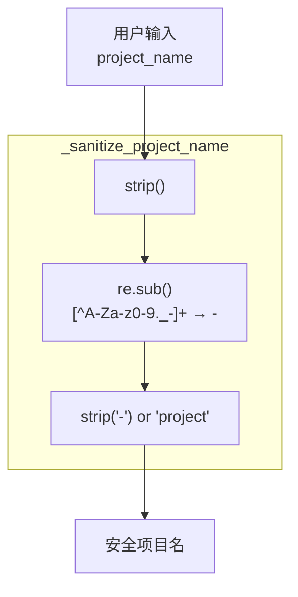

# 特性 10：项目名消毒

## 概述

`list_plans()` 使用 `_sanitize_project_name()` 函数确保项目名安全用于文件系统，移除或替换非法字符。

## 概览

| 方面 | 说明 |
|------|------|
| **允许字符** | `A-Za-z0-9._-` |
| **非法字符** | 替换为 `-` |
| **首尾处理** | 去除首尾 `-` 和空白 |
| **空值处理** | 返回默认值 `project` |

## 设计意图

**解决的问题**：
- 文件名包含非法字符导致系统故障
- 特殊字符在命令行中引发问题
- 确保跨平台文件系统兼容

**设计决策**：
- 白名单方式（仅允许明确安全的字符）
- `-` 作为通用替换符（直观）
- 空输入有合理默认值

## 消毒规则

```python
def _sanitize_project_name(name: str) -> str:
    name = name.strip()                              # 1. 去除首尾空白
    name = re.sub(r"[^A-Za-z0-9._-]+", "-", name)  # 2. 非法字符转 -
    return name.strip("-") or "project"              # 3. 去除首尾-，空则默认
```

### 字符转换表

| 输入字符 | 处理结果 |
|----------|----------|
| 字母 `a-zA-Z` | 保留 |
| 数字 `0-9` | 保留 |
| `.` `_` `-` | 保留 |
| 空格 | 替换为 `-` |
| `!@#$%^&*()` | 替换为 `-` |
| 中文/Unicode | 替换为 `-` |
| `/` `\` | 替换为 `-` |

### 转换示例

| 输入 | 步骤1后 | 步骤2后 | 最终 |
|------|---------|---------|------|
| `" backend "` | `"backend"` | `"backend"` | `"backend"` |
| `"My Project!"` | `"My Project!"` | `"My-Project-"` | `"My-Project"` |
| `"a/b\\c"` | `"a/b\\c"` | `"a-b-c"` | `"a-b-c"` |
| `"  spaces  "` | `"spaces"` | `"spaces"` | `"spaces"` |
| `""` | `""` | `""` | `"project"` |
| `"!!!"` | `"!!!"` | `"---"` | `"project"` |

## 架构



## 契约（Contract）

| 方面 | 说明 |
|------|------|
| **输入** | `str`（任意字符串） |
| **输出** | 安全用于文件名的 `str` |
| **副作用** | 无 |
| **错误** | 无（空输入有默认值） |
| **幂等** | 是 |
| **版本** | v1.0.0 稳定 |

## 集成矩阵

| 依赖 | 接口语义 | 失败策略 |
|------|----------|----------|
| `str.strip()` | 去除空白 | 永不失败 |
| `re.sub()` | 正则替换 | 永不失败 |

## 使用示例

### Algorithm：消毒流程

```
BEGIN FUNCTION _sanitize_project_name(name)
  # 步骤1：去除首尾空白
  result = name.strip()

  # 步骤2：替换非法字符
  result = re.sub(r"[^A-Za-z0-9._-]+", "-", result)

  # 步骤3：去除首尾-，空则默认值
  result = result.strip("-")

  IF result IS EMPTY
    RETURN "project"
  ELSE
    RETURN result
  END IF
END FUNCTION
```

### Python 示例

```python
from jcode_plans.store import _sanitize_project_name

# 正常输入
print(_sanitize_project_name("backend-api"))  # backend-api

# 带空格
print(_sanitize_project_name("my project"))  # my-project

# 带特殊字符
print(_sanitize_project_name("test@v2!"))     # test-v2-

# 纯特殊字符
print(_sanitize_project_name("!!!@@@"))        # project

# 空字符串
print(_sanitize_project_name(""))             # project

# 路径注入尝试
print(_sanitize_project_name("../../../etc"))  # etc

# 中文
print(_sanitize_project_name("后端项目"))      # project（无合法字符）
```

### 安全效果演示

```python
from jcode_plans import PlanStore
from pathlib import Path

store = PlanStore(Path.cwd())

# 恶意/无效项目名会被消毒
store.create_plan_file("../../../etc/passwd")  # 创建文件: etc-passwd-xxx.md
store.create_plan_file("rm -rf /")              # 创建文件: rm-rf-xxx.md
store.create_plan_file("");                     # 创建文件: project-xxx.md

# 列出验证
plans = store.list_plans()
print([p.name for p in plans])
```

## 失败与降级

| 输入 | 行为 | 输出 |
|------|------|------|
| `None` | 抛出 `TypeError` | N/A |
| `""` | 返回默认值 | `"project"` |
| 全空白 | 返回默认值 | `"project"` |
| 全特殊字符 | 返回默认值 | `"project"` |

**注意**：`create_plan_file()` 对 `None` 有特殊处理，会使用 `working_dir.name`。

## 高级主题

### 自定义消毒规则

```python
def custom_sanitize(name: str, allowed: str = "A-Za-z0-9._-") -> str:
    """允许自定义允许字符集"""
    import re
    name = name.strip()
    pattern = f"[^{allowed}]+"
    result = re.sub(pattern, "-", name)
    return result.strip("-") or "project"

# 仅允许字母和数字
print(custom_sanitize("test-v2", allowed="A-Za-z0-9"))
# test-v2
```

### 长度限制

```python
def sanitize_with_length_limit(name: str, max_len: int = 50) -> str:
    """限制结果长度"""
    import re
    result = _sanitize_project_name(name)
    if len(result) > max_len:
        result = result[:max_len].rstrip("-")
    return result or "project"
```

## 限制与权衡

| 限制 | 说明 |
|------|------|
| **信息丢失** | 中文、表情等被完全替换 |
| **长度无限制** | 超长项目名可能导致文件名过长 |
| **不可逆** | 无法从消毒结果还原原始名称 |
| **非上下文感知** | 对路径分隔符与普通字符一视同仁 |

## 相关特性

- [11-feature-project-filtering](11-feature-project-filtering.md) - 项目过滤
- [06-feature-file-naming-convention](06-feature-file-naming-convention.md) - 命名规范
