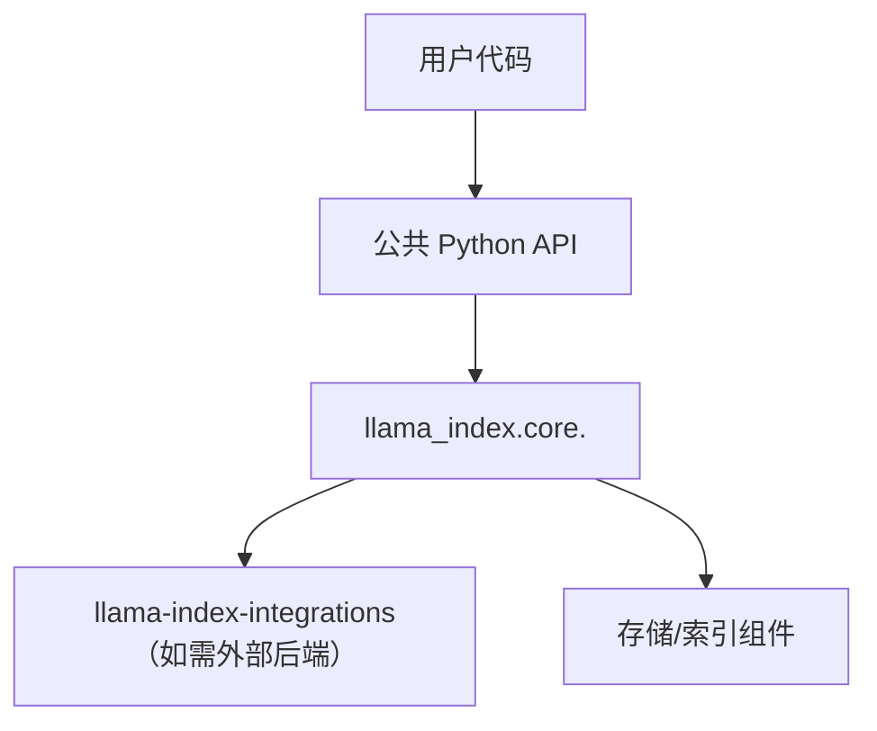
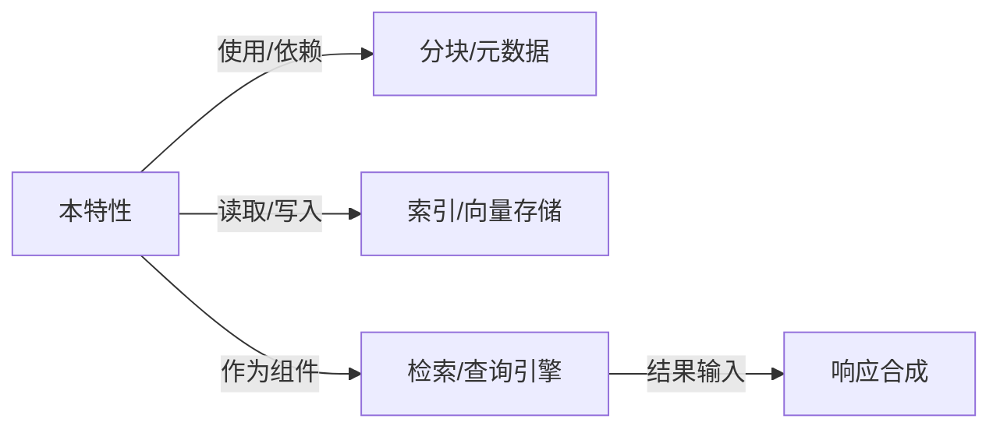
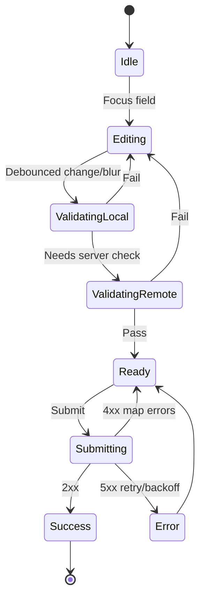

# <功能名称>

> 状态：Draft | In Review | Approved
> 负责人：<name @handle>
> 最近更新：<YYYY-MM-DD>
> 影响范围：packages/modules `llama-index-*/...`，Python 模块 `<pkg>.<mod>`
> 链接：PR、Issue、ADR、文档

---

## TL;DR（2–5 点）

- 设计意图：要解决的核心问题与目标。
- 关键数据结构：核心实体/关系的一句话概述。
- 核心算法：方法要点 + 一句话复杂度。
- 接口入口：主要 API/类名或 CLI 命令。
- 关键权衡：为什么选 A 不选 B。
- 表单要点：表单类型、核心不变量、提交契约（Idempotency-Key）。

---

## 设计意图与范围

- 目标：本特性想达到什么、为何需要。
- 非目标：明确不做/不会覆盖的内容。
- 约束：必须满足的边界条件（版本、接口稳定性、外部限制等）。

---

## 背景

- 缘起：需求、问题或 ADR 摘要。
- 假设：设计成立所依赖的前提。

---

（本模板不聚焦用户故事/验收用语，省略。）

---

## 架构视角（Architecture）

用一段话说明涉及的包/模块与交互边界，强调内部与外部依赖的关系。



关键决策（聚焦设计与算法）

- 决策：<简述> — 理由：<原因> — 备选：<方案/链接>
- …

---

## 集成点（Integration Points）

- 入口位置：`llama_index.core.<module>` 中对外暴露的类/函数（例如 `RetrieverQueryEngine`、`BaseRetriever`、`Index`）。
- 扩展/实现的接口：
  - 检索层：`BaseRetriever._retrieve/_aretrieve`
  - 查询层：`BaseQueryEngine._query/_aquery` 或 `RetrieverQueryEngine`
  - 摄取层：`NodeParser`/分块、`Transform`/后处理器（如适用）
  - 存储层：向量库/存储后端（通过 `StorageContext` 组合）
- 数据路径插入点：
  - 摄取（Document → Node → Embedding）
  - 检索（QueryBundle → NodeWithScore[]）
  - 合成（检索结果 → 响应）
- 关键约定：输入/输出类型、是否幂等、能否并发、是否允许降级或回退。
- 集成步骤与使用说明：
  - 调用位置：明确在业务/框架代码中的挂载点（如注册到服务容器、接入 CLI 命令、写入编排图）。
  - 配置与依赖：列出启用该特性所需的配置项、凭证、外部服务或依赖模块。
  - 运行效果：描述启用后在调用链中的职责、输出、副作用与对上/下游组件的影响。
  - 调用示例：以关键代码片段或 CLI 操作为例，展示如何在实际流程中装配与触发该特性。

---

## 数据模型（Data Model）

- 实体与字段：名称、类型、含义。
- 关系与约束：一对多/多对多、参照完整性、去重/更新策略。
- 不变量与状态机：哪些属性必须保持一致，状态迁移图（如适用）。
- 序列化/反序列化：内部表示与外部表示（仅限必要）。

示例（可用 Python 类型注解或 JSON 示意）：

```python
class Node(TypedDict):
    id: str
    text: str
    metadata: dict[str, Any]
    parents: list[str]
```

必须详述（请逐项填写，不要省略）：

- 字段定义清单：逐一列出字段名、类型、取值范围、默认值、空值策略。
- 标识与引用语义：`id`/`node_id`/`ref_doc_id`/`text_id` 等标识如何生成与唯一性保证；引用的生命周期与悬挂引用处理（dangling）。
- 关系模型：用文字或 Mermaid（classDiagram/erDiagram）给出实体关系与多重性；注明强/弱引用、所有权边界。
- 不变式：必须始终满足的约束（如“nodes_dict 的 key 必须在 docstore 中存在”“父子关系无环”）。
- 状态与迁移：对象从“创建→索引→更新→删除”的状态机/时序，包含异常/回滚路径。
- 存储映射：字段如何落入 `docstore/index_store/vector_store/graph_store`，以及重复存储/去重规则。
- 变更语义：插入/更新/删除时的数据结构变化（前后对比），冲突与并发现象的解决策略。
- 示例数据：给一个最小但真实的 JSON 片段，展示关键字段与关系（含 1–2 个边界值）。

---

## 核心算法（Core Algorithm）

- 思路概述：算法目标、适用场景、关键步骤。
- 伪代码：

```python
def algo(input):
    # 步骤 1：...
    # 步骤 2：...
    # 步骤 3：...
    return output
```

- 复杂度：时间/空间复杂度；与输入规模（N、M、L）关系。
- 正确性要点：为何可行；关键不变量/证明思路。
- 边界与退化：空输入、超长文本、冲突/重复、截断/溢出等处理。
- 随机性/启发式：是否包含随机性或启发式及其影响。
- 并发与顺序性：是否可并行、顺序依赖如何处理。

必须详述（请逐项填写，不要省略）：

- 详细步骤：自输入到输出的逐步展开（含前置校验、归一化、主流程、后处理）。
- 带注释伪代码：关键行解释“做什么/为什么这样做”，必要时给出等价数学表达式或规则表。
- 示例走查：构造一个最小输入，展示每一步中间状态（文本→分块→向量→候选→重排→输出）。
- 复杂度与资源：给出严格的大 O，并标注主要常数因子（如嵌入/LLM 调用次数、批大小 B 的影响、IO 次数）。
- 参数与影响：列出与算法相关的参数（如 `top_k/num_children/max_keywords`），说明对召回/精度/成本/延迟的影响与推荐区间。
- 失败与回退：上游缺失元数据、嵌入失败、外部后端异常时的处理与降级策略。
- 并发模型：是否支持多线程/异步，关键临界区与去重/幂等保证（含重试语义）。
- 正确性论证：引用不变量与“局部 → 全局”正确性关系；如有已知反例或局限请说明并给出规避建议。

代码+文字要求：每段代码后必须用文字解释“意图、输入/输出、关键步骤与语义边界”，否则视为不完整说明。

---

## 设计权衡与替代方案（Trade-offs）

- 我们选择的方案：优势/劣势。
- 未选方案：为何放弃、适用在何种场景。
- 可切换点：将来如何演进或替换。

---

## 公共接口与语义（Public API & Semantics）

- Python API：新增/变更的类与函数、参数与返回、错误语义（简述）。
- 语义约定：输入合法性、幂等性、可重复执行的保证。
- 版本稳定性：是否试验性（仅做简短标注）。

用法最小示例：

```python
from llama_index.core import <entrypoint>

# 最小示例
...
```

- CLI（如适用）：`llamaindex-cli` 下的命令与参数。

```bash
llamaindex-cli <command> [--flags]
```

---

## 与相关特性的关系（Relationships）

- 上游：与分块（Chunking）/元数据（Metadata）/摄取流水线的依赖关系。
- 同级：与其他检索/查询/索引类型的可替换关系与组合方式。
- 下游：对响应合成（Response Synthesizer）、Chat/Agent 等上层能力的影响。



要点：明确数据如何在相关特性间流动、何处能够被替换/扩展、以及替换的语义前提。

---

## 代码示例与讲解（Code + Commentary）

示例：自定义检索器并集成到查询引擎（示意骨架）

```python
from __future__ import annotations
from typing import List

from llama_index.core.retrievers import BaseRetriever
from llama_index.core.schema import QueryBundle, NodeWithScore
from llama_index.core.query_engine import RetrieverQueryEngine


class MyFeatureRetriever(BaseRetriever):
    def __init__(self, index, top_k: int = 3):
        self._index = index  # 依赖的索引/向量库/图存储等
        self._top_k = top_k

    def _retrieve(self, query_bundle: QueryBundle) -> List[NodeWithScore]:
        # 步骤 1：从 QueryBundle 获取查询字符串/结构化信息
        q = query_bundle.query_str

        # 步骤 2：调用底层索引/存储，得到候选节点（带分数）
        # candidates: list[NodeWithScore] = self._index.search(q)

        # 步骤 3：可选后处理（去重/重打分/合并）
        # candidates = postprocess(candidates)

        # 步骤 4：返回 top_k 结果（需满足 NodeWithScore 契约）
        # return candidates[: self._top_k]
        return []  # 占位：作者需替换为实际实现


# 集成到查询引擎
# engine = RetrieverQueryEngine.from_args(retriever=MyFeatureRetriever(index, top_k=5))
# response = engine.query("示例问题")
# print(response)
```

讲解：

- 契约：必须实现 `BaseRetriever._retrieve/_aretrieve`，输入为 `QueryBundle`，输出为 `List[NodeWithScore]`。
- 语义：检索器不负责“生成回答”，仅负责返回相关节点（及其分数）；回答由上层 QueryEngine/合成器完成。
- 集成点：通过 `RetrieverQueryEngine.from_args(retriever=...)` 将检索器与查询流程连接。
- 可替换性：同类检索器应满足一致的输入/输出语义，便于 A/B 或级联组合（如融合检索）。

提示：若本特性不是检索器，请以相同“代码 + 讲解”的方式，给出最小但完整的用例与文字说明。

---

## 表单特性附录（Form Appendix）

### 表单类型与范围

- 创建/编辑/内联/向导/分步
- 成功指标：完成率、平均用时、错误率、每次提交请求数

### 字段矩阵（Field Matrix）

- 列：key、label、类型、必填、约束（范围/长度/模式）、默认值、依赖/显隐、客户端校验、服务端校验、错误语义（字段/全局）、示例值

```yaml
fields:
  - key: email
    label: 邮箱
    type: email
    required: true
    constraints:
      pattern: '^[^@\\s]+@[^@\\s]+\\.[^@\\s]+$'
      maxLength: 254
    validation:
      client: pattern
      server: uniqueness
    error_messages:
      required: 请输入邮箱
      pattern: 邮箱格式不正确
      conflict: 邮箱已被占用
  - key: age
    label: 年龄
    type: number
    required: false
    constraints:
      min: 0
      max: 120
    validation:
      client: range
      server: none
```

### 表单 Schema（JSON Schema/Pydantic）

```yaml
$schema: "https://json-schema.org/draft/2020-12/schema"
title: UserProfileForm
type: object
required: ["email"]
properties:
  email: {type: "string", format: "email", maxLength: 254}
  age: {type: "integer", minimum: 0, maximum: 120}
```

### 校验与提交（Validation & Submission）

- 本地校验优先；远端校验（唯一性/权限）采用防抖与并发折叠
- 幂等：提交携带 `Idempotency-Key`，超时可安全重试
- 错误映射：后端错误码→字段/全局消息→可达性（屏幕阅读器）



### 后端契约（API Contract）

- 路径/方法/Header：`POST /api/users`，`Idempotency-Key: <uuid>`
- 请求体：`{ email, age }`
- 成功：`201 { id, ... }`
- 错误：
  - `409 {code: "EMAIL_CONFLICT", field: "email", message: "邮箱已被占用"}`
  - `422 {errors: [{field, code, message}]}`

### 交互与可用性（UX）

- 键盘流、粘性错误区域（aria-live polite）、按需内联错误、分步进度/保存
- 动态显隐/禁用的可达性与焦点管理

---

## 限制与边界条件（Limitations）

- 现阶段已知的限制与不支持情形。
- 规模/资源边界：何时性能明显退化或不可用。

---

### 评审清单（聚焦设计与算法）

- [ ] 设计意图与非目标清晰、边界明确
- [ ] 数据模型定义和不变量完整
- [ ] 核心算法含伪代码、复杂度与边界处理
- [ ] 关键权衡与替代方案阐述充分
- [ ] 公共接口与语义（输入/输出/错误）明确
- [ ] 最小示例可帮助快速理解语义
- [ ] 限制与边界条件记录完整

### 评审清单（表单）

- [ ] 字段矩阵完整且含错误语义与依赖
- [ ] 本地/远端校验链路与并发策略明确
- [ ] API 契约含幂等、错误结构与映射

---

作者提示

- 写清“不变量”“状态迁移”“输入/输出语义”，避免模糊表述。
- 伪代码优先于大段文字解释；必要时给出关键公式/规则。
- 以“为何正确”和“为何选择该方案”为主线陈述。
