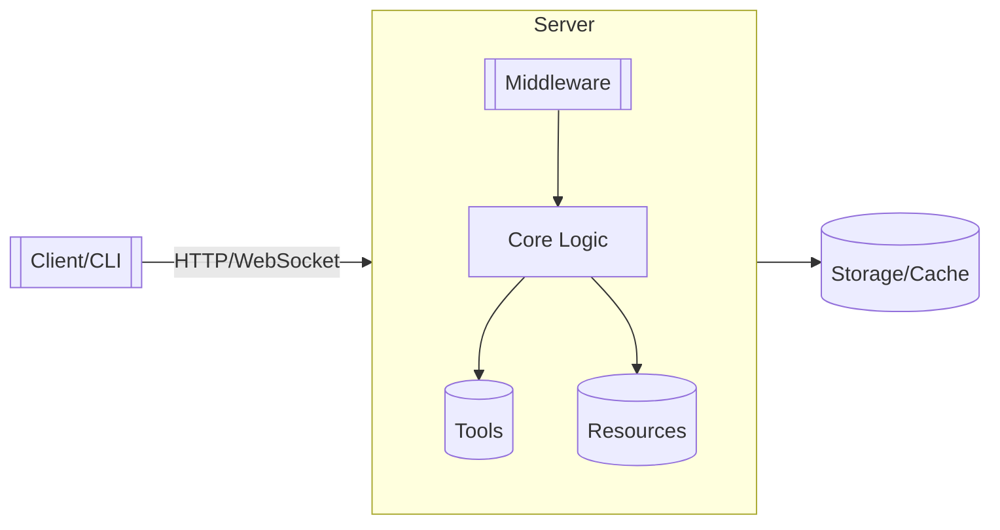
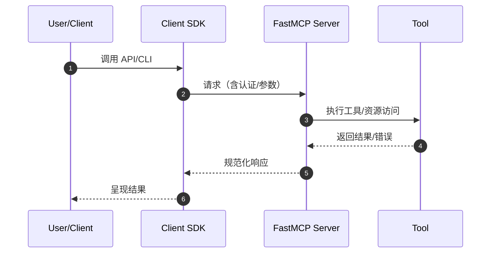

# 功能文档深化提示词（基于草稿重新调研并完善）

你是一名资深工程师/技术写作者。以已有的功能文档草稿为基础，重新调研代码库，对该功能进行更深入、可运行、可落地的完善，并输出结构化的中文文档。文档格式与写作规范以 `design/how-to.md` 与 `design/demo.template` 为准。

## 输入
- 功能草稿文件路径：`design/NN-<slug>.md`（例如：`design/03-authentication.md`）

## 目标
- 将草稿升级为细节完备、包含运行示例与图示的文档
- 使用 Mermaid 图表辅助理解（至少提供 1 个架构/流程图）
- 每个代码块配套说明文字，解释背景、关键参数与预期结果
- 引用关键代码与测试，使用 `path:line` 形式
- 与 `design/how-to.md`、`design/demo.template` 保持一致的结构与语气

## 方法
1. 阅读草稿与规范
   - 通读草稿 `design/NN-<slug>.md`
   - 对照 `design/how-to.md` 与 `design/demo.template` 明确章节与语气
2. 重新调研代码库
   - 快速扫描 `README*`、`docs/**`、`examples/**`、`CHANGELOG*`、`pyproject.toml`/`package.*`、CLI 入口、HTTP 路由、公共模块、`tests/**`
   - 定位对外表面：CLI/API/SDK/配置、MCP 对象（Tools/Resources/Resource Templates/Prompts）
3. 证据与引用
   - 为关键行为找到对应的源码与测试，添加 `path:line` 引用
   - 以示例与测试为依据，避免主观猜测
4. 图示补充（Mermaid）
   - 绘制至少 1 个图表（架构/流程/时序），突出角色、边界与数据流
5. 示例与解释
   - 提供最小可运行示例（≤15 行），并在代码块附近添加“说明”文字：用途、关键点、预期输出/副作用
6. 结构化完善
   - 按模板补全：概览、何时使用、快速开始、关键 API/CLI、集成与交互、限制、边界/高级、故障排查、参考
7. 质量检查
   - 语言简洁可扫读；引用充分；图示清晰；示例可运行

## Mermaid 图示模板片段
- 架构/组件关系（flowchart）

说明：展示客户端到服务端、服务端内部结构与外部依赖（中间件、工具、资源、存储）。按实际仓库替换节点名称与连线标签。

- 时序/调用流程（sequenceDiagram）

说明：刻画用户动作到服务端执行与返回的关键阶段，标注认证/参数/错误返回点。

## 代码块规范
- 每个代码块需在上方或下方紧跟“说明”段，解释：
  - 使用场景与意图
  - 关键参数/返回值/副作用
  - 预期输出（必要时附简短输出片段）
- 示例（Python + 说明）
```python
from fastmcp import FastMCP, Client

mcp = FastMCP("Demo")

@mcp.tool
def greet(name: str) -> str:
    return f"Hello, {name}!"

# 直接连接，避免网络复杂度
async def demo():
    async with Client(mcp) as client:
        return await client.call_tool("greet", {"name": "World"})
```
说明：定义最小 FastMCP 服务与工具，通过内存直连的客户端调用 `greet`，预期返回 `Hello, World!`。

- 示例（CLI + 说明）
```bash
uv run fastmcp run server.py   # 启动服务器
uv run fastmcp inspect server.py  # 检查已暴露的工具/资源
```
说明：用 CLI 启动与检查服务能力；若使用网络传输，应在相应位置标注认证与端口配置。

## 输出
- 直接给出更新后的完整文档内容（覆盖原草稿文件 `design/NN-<slug>.md`）
- 在文档末尾追加“变更摘要”：本次新增的图示、示例、引用与结论
- 附“验证清单”：如何最小化验证文档中的示例（命令/脚本列表）

## 质量核对清单
- 至少 1 个 Mermaid 图（结构或流程）
- 每个代码块均有“说明”段
- 至少 3 处 `path:line` 引用（源码/测试/文档）
- 示例可运行（含必要导入/命令）
- 与 `design/how-to.md`、`design/demo.template` 结构一致

## 提交与命名
- 保持原文件路径与名称不变：`design/NN-<slug>.md`
- 若发现章节需要重排，请在“变更摘要”中说明理由

## 可选的机器可读补充
```
feature_file: design/NN-<slug>.md
updated_at: {ISO8601}
refs:
  code: ["path:line", ...]
  tests: ["path:line", ...]
  docs: ["path", ...]
artifacts:
  diagrams: ["type: flowchart|sequence", "purpose: ..."]
validation:
  steps:
    - cmd: "uv run pytest -q -k <keyword>"
      expect: "tests 通过或产出指定快照"
```
